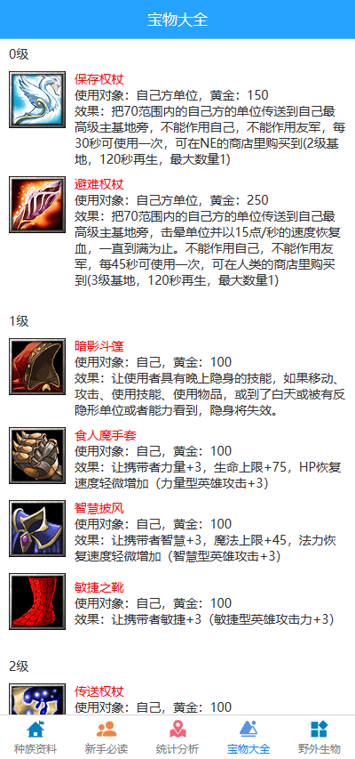
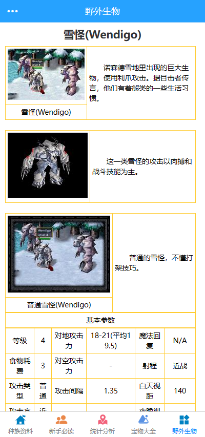

# 魔兽争霸

## 项目简介

魔兽争霸相关资料

## 项目截图

<br>
<br>
<br>
<br>
<br>
<br>

## 技术栈

- **前端**：uniapp

- **后端**：Node，Express框架，crawler
- **数据库**：Mysql

## 项目构建
### 前端
基于`uniapp`开发，前端代码在`front/`文件夹中 

### 后端
- 使用`Node`的`express`框架，连接`Mysql`数据库，做数据接口开发，数据的增删改查与简单封装。

## 项目运行

``` bash
# 克隆项目
git clone https://github.com/WillisYe/fe.git

# 分别进入front/，server/文件夹分别下载依赖
cd front/server/node

npm install

# 导入mysql数据库表

# front下前端项目 打开端口localhost:8080
npm run serve

# serve下运行后端项目（必须先导入数据库表）
DEBUG=myapp:* npm start

# 前端项目打包
npm run build

```

作者 <a href="https://github.com/WillisYe/">dary</a> 

2019 年 8月 6日 